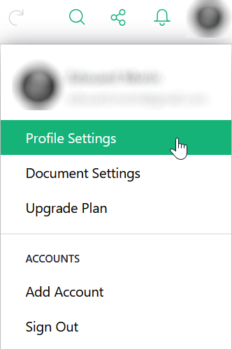
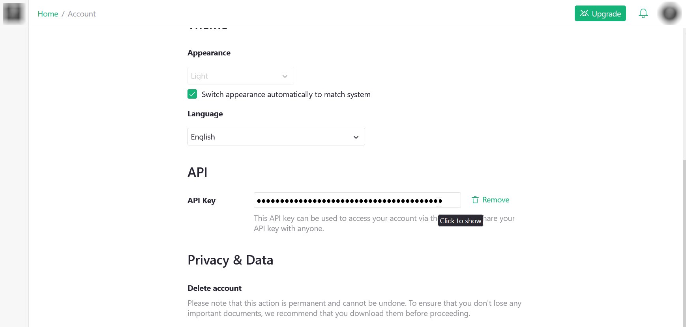
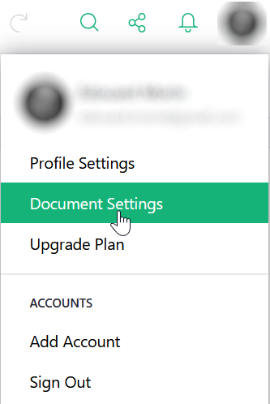
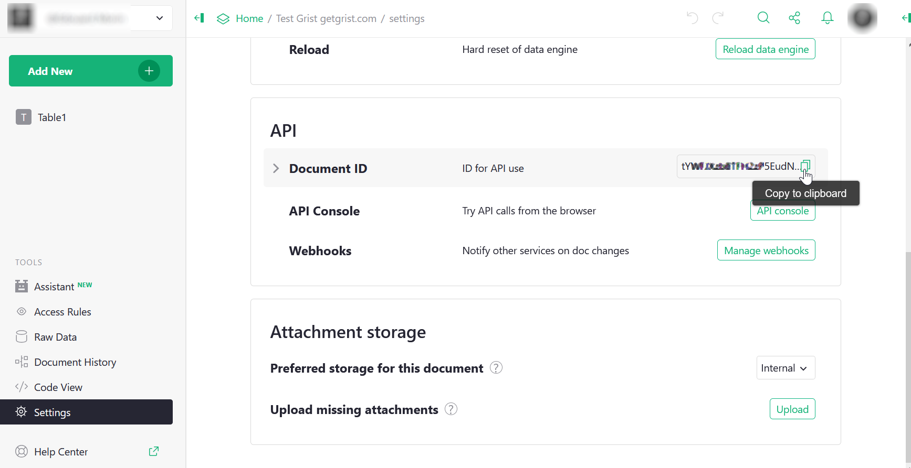

# Using `gristapi` 

## Recover your API key
Any user logged in to https://docs.getgrist.com has an API key that allows them to read/write to documents they have permissions to (see https://support.getgrist.com/).

To retrieve this key, go to "Profile Settings" from your profile icon.



Then at the bottom of the page you can copy your API key.



It is recommended to set this key as an environment variable, so that it does not appear in your R scripts. In our examples, this key will be injected by `Sys.getenv("GETGRIST_KEY")`.

## Retrieve the API ID of a document
To obtain the identifier, you must first locate yourself on this document in the Grist interface, then in the same way as before, go to "Document settings" from the icon of your profile.



Puis dans la partie "API" de la page, vous pouvez copiez l'identifiant du document.



It is also recommended to put this identifier in an environment variable, in our examples, this identifier will be injected by `Sys.getenv("GETGRIST_DOC_TEST")`.

## Initialize the connection

The first thing to do to use gristapi is to initialize the connection to the Grist API of the document (which can contain several sheets or tables).

```{r setup}
library(gristapi)
api <- grist_api$new(
  server = 'https://docs.getgrist.com',
  api_key = Sys.getenv("GETGRIST_KEY"),
  doc_id = Sys.getenv("GETGRIST_DOC_TEST")
)
```

If no error message appears, the connection to your API was successful and the `api` object can now be used to process the data and sheets of your document from R.

The details of your connection information (document metadata) are displayed in the console, simply by displaying the object:

```
api

#> [1] "-----------------"
#> [1] "grist_api print"
#> [1] "-----------------"
#> [1] "<Document info>"
#> $name
#> [1] "Test Grist getgrist.com"
#> 
#> $createdAt
#> [1] "2025-07-21T08:37:26.704Z"
#> 
#> $updatedAt
#> [1] "2025-07-22T14:14:11.188Z"
#>  
...
```

The main methods of the object thus created are  [`call()`](../reference/grist_api.html#method-grist_api-call), [`table_to_json()`](../reference/grist_api.html#method-grist_api-table_to_json), [`json_to_table()`](../reference/grist_api.html#method-grist_api-json_to_table).

## Create a table

To create a table, use the `add_records` function with the `create_or_replace=TRUE` option. The table is assigned an identifier without spaces or special characters (`table_id`) and given a `data.frame` to inject (`record_dicts`).

```{r, addtable, eval = (get_os() == "linux")}
add_records(api,
  table_id = "iris",
  record_dicts = iris,
  create_or_replace = TRUE
  )
```
This function returns the vector of ids (integers) created in the table.

Please note that all tables (or sheets) created in Grist are assigned an identifier beginning with a capital letter! Similarly, if your column names contain ".", they will be automatically replaced with "_".

It is therefore recommended to use the `listtables()` and `listcolumns()` functions after creating a table to ensure that the naming of the structure will not affect your subsequent processing.

## Explore the data in a table

To import data from a table into R, use the `fetch_table` function. If the `filters` option is not present, all data from the table is retrieved.

```{r, readtable1, eval = (get_os() == "linux")}
giris <-fetch_table(api, "Iris")
head(giris)
```

If you want to filter before importing the data (useful for large tables), you must provide a filter written as indicated in the [Grist documentation](https://support.getgrist.com/api/#tag/records/operation/listRecords)

```{r, readtable2, eval = (get_os() == "linux")}
gvirginica <- fetch_table(api, "Iris", filters = 'filter={"Species": ["virginica"]}')
head(gvirginica)
```

It is also possible to sort the data and limit the number of rows.

```{r, readtable3, eval = (get_os() == "linux")}
gbigpetal <- fetch_table(api, "Iris", filters = 'sort=-Petal_Width&limit=10')
gbigpetal
```

## Add, edit and delete rows

To **add rows** to a table, we use the `add_records` function again. The submitted data.frame must not contain a column named `id` and its structure must be identical to that of the destination table.

```{r, addrecords, eval = (get_os() == "linux")}
records <- data.frame(
  Sepal_Length = c(6.5,6.2), 
  Sepal_Width = c(2.9,3.3), 
  Petal_Length = c(3.5,3.1), 
  Petal_Width = c(7.4,6.9), 
  Species = c("missouriensis","missouriensis")
  )

add_records(api, "Iris", records)
```
This function returns an integer vector containing the `id`s of the new rows, if the save was successful (only the first 500 ids are returned).

To **edit** rows in a table, use the `update_records` function. The submitted data.frame must contain a column named `id` to target the rows to be updated. The structure must be contained by the structure of the destination table.

```{r, modifyrecords, eval = (get_os() == "linux")}
records <- data.frame(
  id = as.integer(c(1,2)),
  Sepal_Length = c(5.1,5.0), 
  Sepal_Width = c(3.5,3.1), 
  Petal_Length = c(1.5,1.4)
  )

update_records(api, "Iris", records)
```
This function returns TRUE if the recording was successful.

To **delete** rows from a table, use the `delete_records` function. A vector of integers containing the `id`s of the rows to be deleted is submitted.

```{r, deleterecords, eval = (get_os() == "linux")}

delete_records(api, "Iris", as.integer(c(3,4)))
```
This function returns TRUE if the deletion was successful.

## Replace or synchronize the table

To **replace** all the data in a table, you must, as when creating the table, use the `add_records` function with the `create_or_replace=TRUE` option. In this case, you delete and recreate a new table with the same identifier, so you can modify the structure. Be careful, in the case of a table replacement you lose any filters, styles or relationships saved from the Grist interface for this table (you may need to prioritize deleting the entire ID sequence and then simply adding all the rows).

```{r, remplacerecords, eval = (get_os() == "linux")}
oldiris <- fetch_table(api, "Iris") |> subset(select = c(-id))
newiris <- data.frame(my_id = 1:nrow(oldiris), oldiris)

add_records(api,
  table_id = "Iris",
  record_dicts = newiris,
  create_or_replace = TRUE
  )

```

The Grist API provides a synchronization method that, based on a unique key, either adds the entry or updates the existing one. Thus, to **synchronize** a data frame to a table, we use the `sync_table` function. The submitted data frame must not contain a column named `id` and its structure must be identical to that of the destination table. The unique key can be on one or more fields.

```{r, syncrecords, eval = (get_os() == "linux")}

new_data <- fetch_table(api, "Iris", filters = 'filter={"Species": ["missouriensis"]}')
new_data$Species <- "japonica"
new_data$my_id[new_data$my_id == 150] <- 151
new_data <- new_data |> subset(select = c(-id))
new_data

sync_table(api, "Iris", new_data, key_cols = c("my_id"))

tail(fetch_table(api, "Iris"))

```

# Advanced use

It is possible to customize your exploration queries in tables using the `sql` endpoint and the `call` method of gristapi.

Examples : 

```{r, sqlrecords, eval = (get_os() == "linux")}

req_sql <- "select * from Iris where Sepal_Length > 5 and Sepal_Width < 4"

api$json_to_table(
  api$call(
    url = paste0("/sql?q=",URLencode(req_sql)), 
    type_resp = "string"
  ), 
  "records"
)

```
