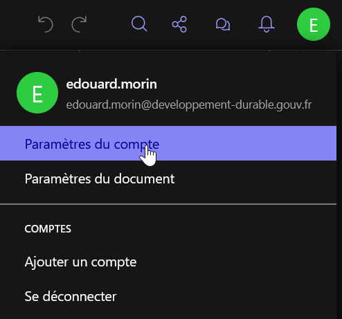
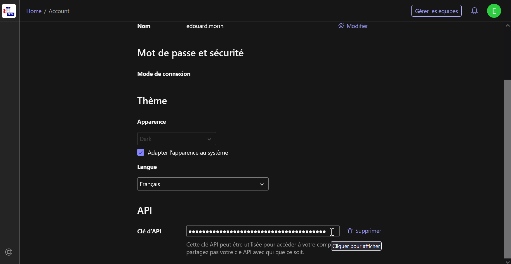
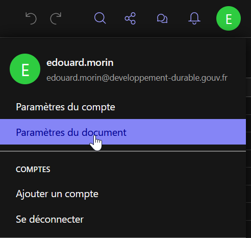
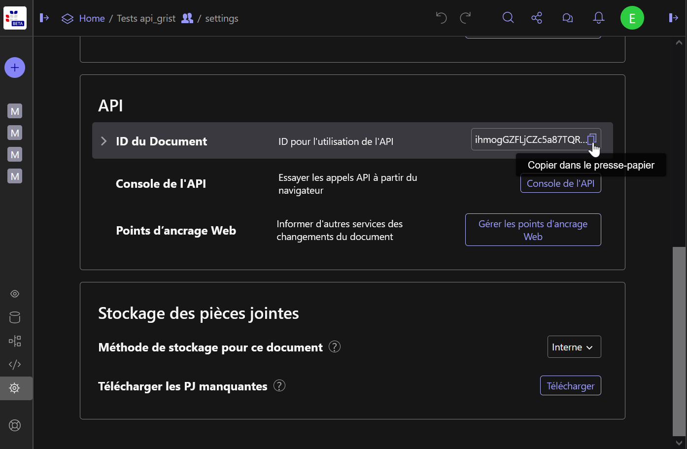

```{r, include = FALSE}
knitr::opts_chunk$set(
  collapse = TRUE,
  comment = "#>"
)
```

# Utiliser `gristapi` 

## Récupérer sa clé API
Tout utilisateur connecté à https://grist.numerique.gouv.fr dispose d'une clé d'API qui lui permet de lire/écrire dans les documents dans lesquels il a les autorisations (voir https://support.getgrist.com/fr/).

Pour récupérer cette clé, il faut aller dans "Paramètres du compte" depuis l'icone de votre profil.



Puis en bas de la page, vous pouvez copiez votre clé d'API.



Il est conseillé de mettre cette clé en variable d'environnement, afin qu'elle n'apparaisse pas dans vos scripts R. Dans nos exemples, cette clé sera injectée via `Sys.getenv("GRIST_KEY")`.

## Récupérer l'identifiant API d'un document
Pour obtenir l'identifiant, il faut en premier se situer sur ce document dans l'interface de Grist, puis de la même manière que précédemment, aller dans "Paramètres du document" depuis l'icone de votre profil.



Puis dans la partie "API" de la page, vous pouvez copiez l'identifiant du document.



Même s'il n'est pas indispensable de mettre cet identifiant en variable d'environnement, dans nos exemples, cet identifiant sera injectée via `Sys.getenv("GRIST_DOC_TEST")`.

## Initialiser la connexion

La première chose à faire pour utiliser gristapi, c'est d'initialiser la connexion à l'api Grist du document (qui lui peut contenir plusieurs feuilles ou tables).

```{r setup}
library(gristapi)
api <- grist_api$new(
  server = 'https://grist.numerique.gouv.fr',
  api_key = Sys.getenv("GRIST_KEY"),
  doc_id = Sys.getenv("GRIST_DOC_TEST")
)
```

Si aucun message d'erreur n'apparait, c'est que la connexion à votre api c'est bien déroulé et que l'objet `api` peut désormais être utiliser pour manipuler les données et les feuilles de votre document depuis R.

Le détail des informations de votre connexion (métadonnées du document) s'affiche en console, simplement en affichant l'objet :

```
api

#> [1] "-----------------"
#> [1] "grist_api print"
#> [1] "-----------------"
#> [1] "<Document info>"
#> $name
#> [1] "Tests api_grist"
#> 
#> $createdAt
#> [1] "2025-07-21T08:37:26.704Z"
#> 
#> $updatedAt
#> [1] "2025-07-22T14:14:11.188Z"
#>  
...
```

Les principales méthodes de l'objet ainsi créé sont  [`call()`](../reference/grist_api.html#method-grist_api-call), [`table_to_json()`](../reference/grist_api.html#method-grist_api-table_to_json), [`json_to_table()`](../reference/grist_api.html#method-grist_api-json_to_table).

## Créer une table

Pour créer une table, on utilise la fonction `add_records` avec l'option `create_or_replace=TRUE`. On assigne à la table un identifiant sans espace ni caractères spéciaux (`table_id`) et on lui soumet un `data.frame` à injecter (`record_dicts`).

```{r, addtable, eval = (get_os() == "linux")}
add_records(api,
  table_id = "iris",
  record_dicts = iris,
  create_or_replace = TRUE
  )
```
Cette fonction renvoie le vecteur des id (entiers) créés dans la table.

A savoir, toutes les tables (ou feuilles), créées dans Grist, ont un identifiant commençant par une majuscule ! De même, si vos noms de colonnes comportent des ".", il seront automatiquement remplacés par des "_".

Il est donc conseillé d'utiliser les fonctions `listtables()` et `listcolumns()` après avoir créé une table pour s'assurer que le nommage de la structure n'affectera pas vos traitements ultérieurs.

## Explorer les données d'une table

Pour importer dans R les données d'une table, on utilise la fonction `fetch_table`. En l'absence de l'option `filters`, on rappatrie toutes les données de la table.

```{r, readtable1, eval = (get_os() == "linux")}
giris <-fetch_table(api, "Iris")
head(giris)
```

Si on souhaite filtrer avant d'importer les données (utile pour les tables de grande dimension), on doit fournir un filtre rédigé comme l'indique la [documentation Grist](https://support.getgrist.com/fr/api/#tag/records/operation/listRecords)

```{r, readtable2, eval = (get_os() == "linux")}
gvirginica <- fetch_table(api, "Iris", filters = 'filter={"Species": ["virginica"]}')
head(gvirginica)
```

Il est également possible de trier les données et d'en limiter le nombre de lignes

```{r, readtable3, eval = (get_os() == "linux")}
gbigpetal <- fetch_table(api, "Iris", filters = 'sort=-Petal_Width&limit=10')
gbigpetal
```

## Ajouter, modifier et supprimer des entrées

Pour **ajouter** des entrée dans une table, on utilise, à nouveau, la fonction `add_records`. Le data.frame soumis ne doit pas contenir de colonne nommée `id` et sa structure doit être identique à celle de la table de destination.

```{r, addrecords, eval = (get_os() == "linux")}
records <- data.frame(
  Sepal_Length = c(6.5,6.2), 
  Sepal_Width = c(2.9,3.3), 
  Petal_Length = c(3.5,3.1), 
  Petal_Width = c(7.4,6.9), 
  Species = c("missouriensis","missouriensis")
  )

add_records(api, "Iris", records)
```
Cette fonction renvoie un vecteur d'entier contenant les `id` des nouvelles entrées, si l'enregistrement s'est déroulé correctement (seuls les 500 premiers id sont retournés).

Pour **modifier** des entrée dans une table, on utilise la fonction `update_records`. Le data.frame soumis doit contenir une colonne nommée `id` afin de cibler les entrées à mettre à jour. La structure doit être contenue par celle de la table de destination.

```{r, modifyrecords, eval = (get_os() == "linux")}
records <- data.frame(
  id = as.integer(c(1,2)),
  Sepal_Length = c(5.1,5.0), 
  Sepal_Width = c(3.5,3.1), 
  Petal_Length = c(1.5,1.4)
  )

update_records(api, "Iris", records)
```
Cette fonction renvoie TRUE si l'enregistrement s'est déroulé correctement.

Pour **supprimer** des entrée dans une table, on utilise la fonction `delete_records`. On soumet un vecteur d'entiers contenant les `id` des entrées à supprimer. 

```{r, deleterecords, eval = (get_os() == "linux")}

delete_records(api, "Iris", as.integer(c(3,4)))
```
Cette fonction renvoie TRUE si la suppression s'est déroulé correctement.

## Remplacer ou synchroniser la table

Pour **remplacer** toute les données d'une table, il faut comme à la création de la table, utiliser la fonction `add_records` avec l'option `create_or_replace=TRUE`. Dans ce cas, on supprime et recrée une nouvelle table avec le même identifiant, on peut donc modifier la structure (attention dans ce cas vous perdrez les éventuels filtres, styles ou relations sauvegargés depuis l'interface Grist).

```{r, remplacerecords, eval = (get_os() == "linux")}
oldiris <- fetch_table(api, "Iris") |> subset(select = c(-id))
newiris <- data.frame(my_id = 1:nrow(oldiris), oldiris)

add_records(api,
  table_id = "Iris",
  record_dicts = newiris,
  create_or_replace = TRUE
  )

```

L'api Grist prévoit une méthode de synchronisation qui en fonction d'une clé unique, soit ajoute l'entrée, soit met à jour celle existante. Ainsi, pour **synchroniser** un data.frame à une table, on utilise la fonction `sync_table`. Le data.frame soumis ne doit pas contenir de colonne nommée `id` et sa structure doit être identique à celle de la table de destination. La clé unique peut être sur un ou plusieurs champs.

```{r, syncrecords, eval = (get_os() == "linux")}

new_data <- fetch_table(api, "Iris", filters = 'filter={"Species": ["missouriensis"]}')
new_data$Species <- "japonica"
new_data$my_id[new_data$my_id == 150] <- 151
new_data <- new_data |> subset(select = c(-id))
new_data

sync_table(api, "Iris", new_data, key_cols = c("my_id"))

tail(fetch_table(api, "Iris"))

```

# Utilisation avancée

Il est possible de customiser ses requêtes d'exploration dans les tables en utilisant le "endpoint" `sql` et la méthode `call` de gristapi.

Exemples : 

```{r, sqlrecords, eval = (get_os() == "linux")}

req_sql <- "select * from Iris where Sepal_Length > 5 and Sepal_Width < 4"

api$json_to_table(
  api$call(
    url = paste0("/sql?q=",URLencode(req_sql)), 
    type_resp = "string"
  ), 
  "records"
)

```
